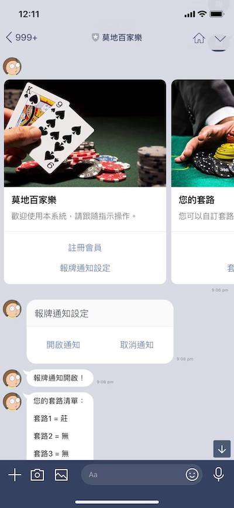

# Chat Bot - Baccarat

## Description

This chat bot used to provide a interaction with user. Help user can set ther own stragry in a online game, and if the game conform user's stragry, the chat bot will send a notice immediately. 

I trained a object detection model to detect the game's screen, and use a algorithm to avoid overlapping and sort the result. 

## Written by

Roy Huang  

National Taiwan University 

Civil Engineering - Department of Computer-Aided Engineering 
